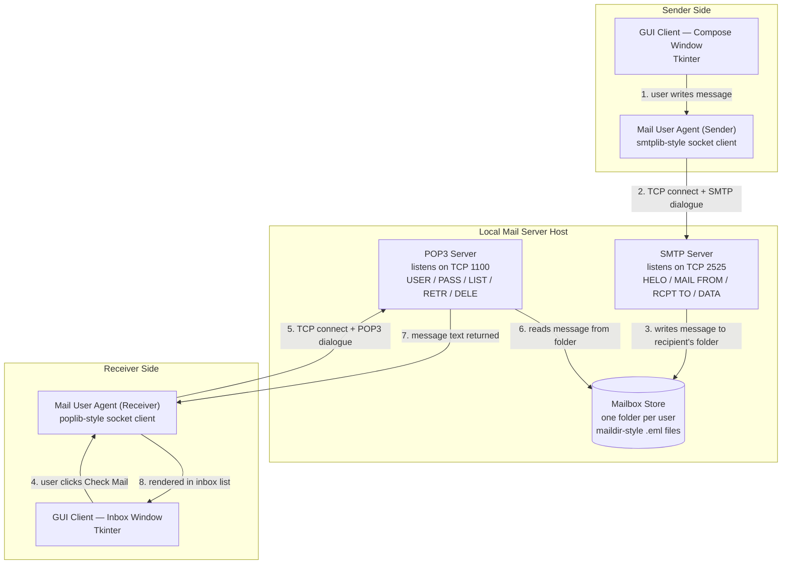
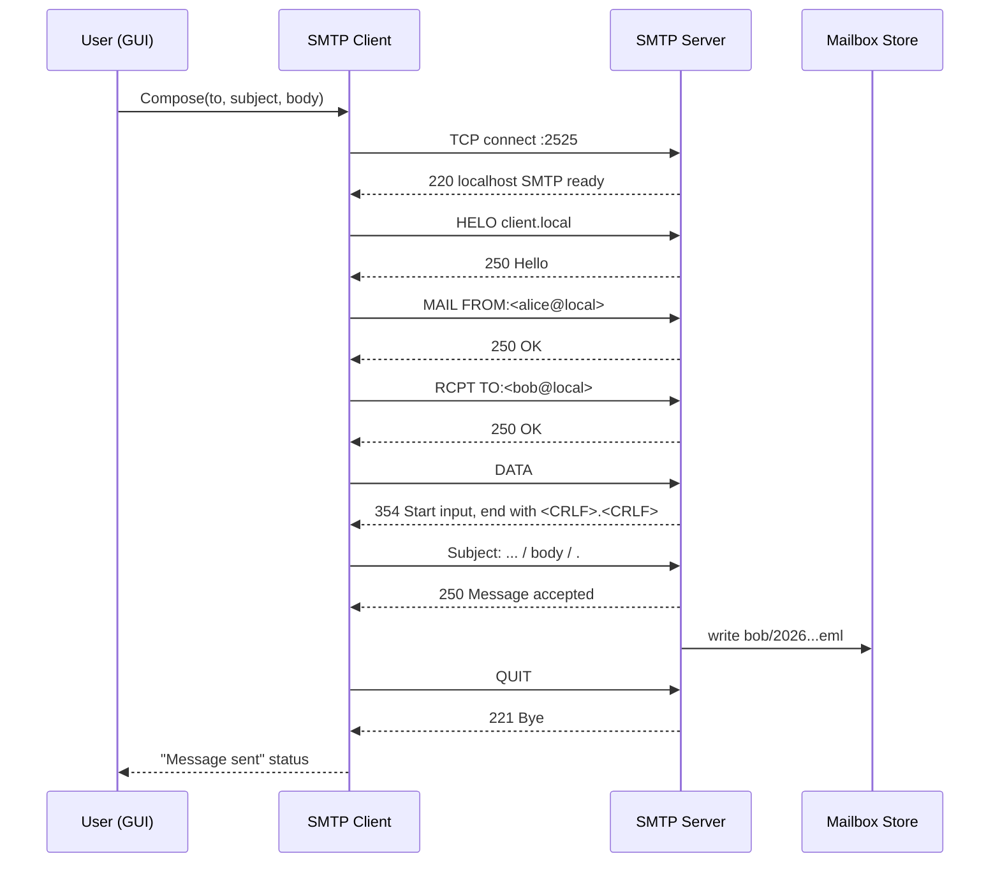
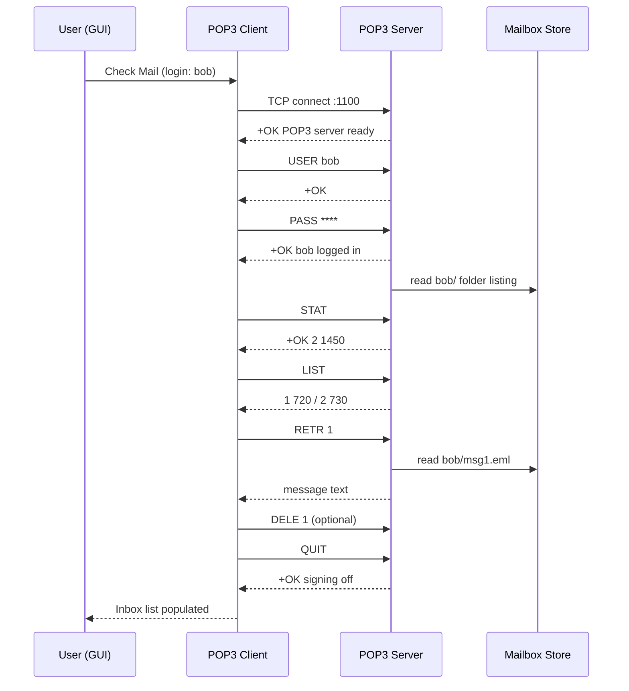

# Local Email Communication System Using SMTP and POP3
### Project Requirement Document (PRD)

**Document type:** Project Requirement Document
**Domain:** Computer Networks — Application Layer
**Protocols:** SMTP (RFC 5321), POP3 (RFC 1939)
**Primary stack:** Python 3, sockets, Tkinter

---

## Contents

1. [Project Overview](#1-project-overview)
2. [Objectives](#2-objectives)
3. [Scope of Work](#3-scope-of-work)
4. [System Architecture](#4-system-architecture)
5. [Data Flow & Protocol Sequence](#5-data-flow--protocol-sequence)
6. [Functional Requirements](#6-functional-requirements)
7. [Non-Functional Requirements](#7-non-functional-requirements)
8. [Technology Stack & Platform Options](#8-technology-stack--platform-options)
9. [Module-Level Design](#9-module-level-design-python-option)
10. [GUI Design Requirements](#10-gui-design-requirements)
11. [Testing & Validation Plan](#11-testing--validation-plan)
12. [Deliverables](#12-deliverables)
13. [Suggested Timeline](#13-suggested-timeline)
14. [References & Standards](#14-references--standards)

---

## 1. Project Overview

Email remains the clearest teaching example of a layered, client–server application protocol: two independent, text-based protocols — one for **sending** (SMTP) and one for **retrieving** (POP3) — cooperate over TCP to move a message from one mailbox to another. This project builds a small, self-contained version of that system entirely on the local machine (or a local network), so every command, response, and byte on the wire can be observed directly rather than taken on faith.

Instead of relying on a real mail provider, the project implements its own minimal SMTP server, POP3 server, mailbox storage, and two client programs, then wraps the clients in a GUI so the request/response conversation between client and server is visible as it happens.

## 2. Objectives

- Implement a working SMTP client–server pair that can compose, address, and deliver an email message between local user mailboxes.
- Implement a working POP3 client–server pair that can authenticate a user and retrieve, list, and delete messages from their mailbox.
- Model multiple user mailboxes with independent storage, so send/retrieve can be demonstrated between at least two accounts.
- Provide a GUI that lets a user compose and send mail, view their inbox, and step through message retrieval — and that visibly reflects the underlying protocol exchange.
- Produce an architecture diagram and protocol sequence diagram that explain every component and every message exchanged, suitable for a viva/demo.
- Document the system so it can equally be explained as a Python/Jupyter implementation or mapped onto a Cisco Packet Tracer topology for a pure networking demonstration.

## 3. Scope of Work

**In scope:** Local (loopback or LAN) SMTP send flow, local POP3 retrieve flow, plain-text mailbox storage, basic authentication, a desktop GUI, and diagrammatic documentation of architecture and message flow.

**Out of scope:** Real internet mail delivery, TLS/STARTTLS encryption, IMAP, spam filtering, attachments beyond plain text, and multi-server federation. These are noted as extension ideas, not requirements.

The system is deliberately minimal: it implements enough of SMTP and POP3 to be protocol-correct for a local demonstration, not a production-grade mail transfer agent.

## 4. System Architecture

Six components, each mapped to a real-world mail system role, all running as local Python processes (or, in the Packet Tracer variant, as configured Server/PC nodes on a topology).

*Fig. 1 — Six-component architecture. The Mailbox Store is the only shared state between the SMTP and POP3 sides; they never talk to each other directly, exactly as in real mail systems where an MTA writes to a spool and an MDA/retrieval server reads from it independently.*

### Component responsibilities

| Component | Role | Talks over |
|---|---|---|
| GUI Client | Compose window, inbox list, message viewer, login screen. Purely presentation — never touches sockets directly. | Function calls to the local MUA modules |
| MUA (sender) | Opens a TCP socket to the SMTP server, plays the SMTP command sequence, reports success/failure back to the GUI. | TCP, port `2525` |
| SMTP Server | Accepts connections, validates commands, appends the finished message into the recipient's mailbox folder. | TCP, port `2525` |
| Mailbox Store | One directory per user (e.g. `mailboxes/alice/`), each message saved as a timestamped `.eml` file. Shared filesystem state, not a live connection. | Filesystem |
| POP3 Server | Authenticates a user against a simple credentials table, then exposes that user's folder through LIST/RETR/DELE. | TCP, port `1100` |
| MUA (receiver) | Opens a TCP socket to the POP3 server, logs in, lists and downloads messages, hands parsed text back to the GUI. | TCP, port `1100` |

> **Why non-standard ports** — real SMTP/POP3 use ports 25 and 110, which are privileged and often blocked by the OS or ISP. Using `2525` and `1100` keeps the servers runnable as an unprivileged local user without changing the protocol logic.

## 5. Data Flow & Protocol Sequence

The two protocols never overlap in time from a single mailbox's point of view — send is a push into storage, retrieve is a pull from storage — so they are shown as two sequences sharing the same store.

### 5.1 Sending a message (SMTP)

*Fig. 2 — Every line is a real SMTP command/reply pair; this is what the GUI's "protocol log" panel should echo as it happens.*

### 5.2 Retrieving messages (POP3)

*Fig. 3 — `DELE` only marks a message; deletion is finalized on `QUIT`, matching real POP3 semantics and worth calling out explicitly in the demo.*

## 6. Functional Requirements

| ID | Requirement |
|---|---|
| `FR-1` | The system shall allow a sender to compose a message with sender, recipient, subject, and body fields. |
| `FR-2` | The SMTP server shall accept a message only after a syntactically valid HELO / MAIL FROM / RCPT TO / DATA sequence. |
| `FR-3` | The SMTP server shall reject RCPT TO for an unknown local user with an appropriate error reply. |
| `FR-4` | Delivered messages shall be persisted to the recipient's mailbox folder before a 250 success reply is sent. |
| `FR-5` | The POP3 server shall require USER/PASS authentication before exposing any mailbox contents. |
| `FR-6` | The POP3 server shall support STAT, LIST, RETR, DELE, and QUIT with standard reply codes. |
| `FR-7` | The GUI shall show a live/near-live log of the protocol commands and replies for at least one in-flight operation. |
| `FR-8` | The GUI shall support at least two distinct user accounts so a send/retrieve exchange between them can be demonstrated. |
| `FR-9` | The system shall support basic mailbox management: view inbox, open a message, delete a message. |

## 7. Non-Functional Requirements

- **Correctness over completeness** — commands and reply codes should follow RFC 5321 / RFC 1939 even though coverage is partial.
- **Observability** — every socket exchange should be loggable (console and/or GUI) since the point of the project is to see the protocol, not just get a result.
- **Local-only operation** — no dependency on internet connectivity or an external mail relay.
- **Fault tolerance** — a malformed command should get a proper error reply, not crash the server.
- **Portability** — the Python implementation should run unmodified with the standard library (no paid services, no external mail API).

## 8. Technology Stack & Platform Options

The brief allows either a software implementation or a network-simulator implementation. They demonstrate different layers of the same idea and are best treated as two independent deliverables rather than forced into one.

**Option A — Python + Jupyter Notebook:** Builds the actual protocol logic — real sockets, real SMTP/POP3 command parsing, a real GUI. Shows *how the protocol works* at the byte level. Best for demonstrating the application layer in depth.

**Option B — Cisco Packet Tracer:** Builds the network — PCs, a switch/router, and Packet Tracer's built-in Email (SMTP/POP3) server service configured on a Server node, with PCs as email clients. Shows *how the network layers underneath* carry the protocol. Best for demonstrating topology, addressing, and end-to-end connectivity.

### 8.1 Python stack (recommended primary deliverable)

| Layer | Library / Tool | Purpose |
|---|---|---|
| Sockets & protocol | `socket`, `socketserver` | Hand-rolled SMTP and POP3 servers — writing the state machine yourself is the point of the exercise, rather than using `smtpd`/`aiosmtpd` as a black box. |
| Client side (optional reference) | `smtplib`, `poplib` | Useful to validate your hand-rolled server against a standard-library client during testing. |
| Concurrency | `threading` | Handle multiple client connections (e.g. two GUI instances) without blocking. |
| Storage | Plain filesystem, `email` module for message formatting | Maildir-style per-user folders; each message a timestamped `.eml` file. |
| GUI | `tkinter` (or `PyQt5` if available) | Login screen, compose window, inbox list, message viewer, protocol log panel. |
| Notebook | Jupyter `.ipynb` | Narrated, cell-by-cell build: start server in a background thread, run client cells, show logs inline — ideal for a walkthrough/demo/viva. |

### 8.2 Cisco Packet Tracer variant

- One **Server** node with its *Email* service enabled — set domain name, add user mailboxes (username/password), and confirm SMTP and POP3 services are both "On".
- Two or more **PC** nodes, each configured with an Email client account (server address, username, password) pointing at the Server's IP.
- A **Switch** (and optionally a **Router** if simulating separate subnets) connecting Server and PCs, with static IP addressing on the same subnet as the simplest case.
- Demonstration: send a message from PC1's email client, then use PC2's client to "Receive" — Packet Tracer's Simulation mode can capture the actual SMTP and POP3 PDUs crossing the wire, which doubles as a live packet-level teaching aid.

> **Suggestion** — if only one deliverable is required, Option A (Python) satisfies "use Python" and "build a GUI" directly; Option B is a strong companion appendix that proves the same concepts hold at the network-simulation level. Doing both gives the fullest picture: Python shows the protocol, Packet Tracer shows the network carrying it.

## 9. Module-Level Design (Python option)

| Module | File | Key responsibilities |
|---|---|---|
| SMTP Server | `smtp_server.py` | TCP listener on 2525; parses HELO/MAIL/RCPT/DATA/QUIT; writes accepted messages to mailbox store; per-connection thread. |
| POP3 Server | `pop3_server.py` | TCP listener on 1100; authenticates against `users.json`; implements STAT/LIST/RETR/DELE/QUIT; per-connection thread. |
| Mailbox Store | `mailbox_store.py` | Helper functions: `save_message()`, `list_messages()`, `read_message()`, `delete_message()` — the only module both servers import. |
| SMTP Client | `smtp_client.py` | Thin wrapper that opens a socket and plays the client half of the Fig. 2 sequence. |
| POP3 Client | `pop3_client.py` | Thin wrapper that opens a socket and plays the client half of the Fig. 3 sequence. |
| GUI | `mail_gui.py` | Tkinter app: login screen → main window with Compose / Inbox tabs and a scrolling protocol-log panel fed by both clients. |
| Notebook | `email_system_demo.ipynb` | Starts both servers in background threads, then runs client calls cell-by-cell with printed logs — the "explain as you go" version of the same code. |

## 10. GUI Design Requirements

The GUI's job is to make the protocol visible, not just to look like an email app. Three panels cover it:

1. **Login** — Username/password fields, mapped to the same credentials table the POP3 server checks against.
2. **Compose & Inbox** — Tabbed view: a compose form (To / Subject / Body / Send) and an inbox list (sender, subject, date) that opens a message on click, with a Delete action.
3. **Protocol log panel** — A read-only, monospace-styled scroll region that prints every command sent and every reply received, timestamped — this is what turns the GUI from "an email app" into "a teaching tool for SMTP/POP3."

## 11. Testing & Validation Plan

| Test | Expected result |
|---|---|
| Send to a valid local recipient | 250 accepted; message file appears in recipient's folder |
| Send to an unknown recipient | SMTP server returns a rejection reply (e.g. 550); no file written |
| POP3 login with wrong password | -ERR reply; session not authenticated |
| LIST on empty mailbox | +OK with zero messages, no error |
| RETR then QUIT without DELE | Message still present on next login |
| DELE then QUIT | Message removed only after QUIT commits it |
| Two GUI clients concurrently | No blocking/deadlock; both sessions logged independently |
| Cross-check against stdlib client | `smtplib`/`poplib` can talk to your servers without protocol errors |

## 12. Deliverables

- **Code:** Python source — `smtp_server.py`, `pop3_server.py`, `mailbox_store.py`, `smtp_client.py`, `pop3_client.py`, `mail_gui.py`
- **Notebook:** `email_system_demo.ipynb` — narrated run-through with inline protocol logs
- **Optional:** Cisco Packet Tracer `.pkt` file with Server + PC topology and configured Email service
- **Docs:** This Project Requirement Document, including architecture and sequence diagrams
- **Demo:** A short recorded or live walkthrough — send a message from User A, retrieve it as User B, showing the log panel throughout

## 13. Suggested Timeline

| Phase | Work |
|---|---|
| 1 | Mailbox store + SMTP server, tested from the command line / a raw socket client |
| 2 | POP3 server, tested against the mailboxes the SMTP server writes to |
| 3 | SMTP & POP3 client wrappers; cross-check against `smtplib`/`poplib` |
| 4 | Tkinter GUI wired to both clients, including the protocol log panel |
| 5 | Jupyter notebook walkthrough; (optional) Packet Tracer topology |
| 6 | Testing pass against Section 11, diagrams finalized, demo rehearsed |

## 14. References & Standards

- RFC 5321 — Simple Mail Transfer Protocol
- RFC 5322 — Internet Message Format
- RFC 1939 — Post Office Protocol, Version 3
- Python standard library documentation — `socket`, `socketserver`, `smtplib`, `poplib`, `email`, `tkinter`
